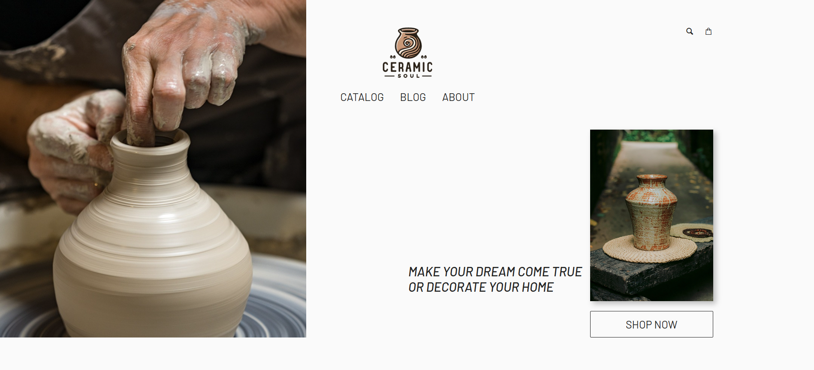
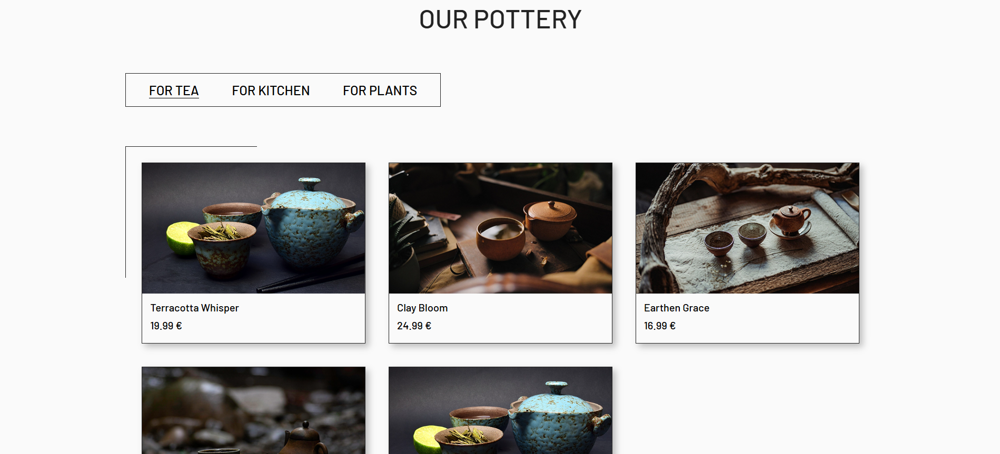
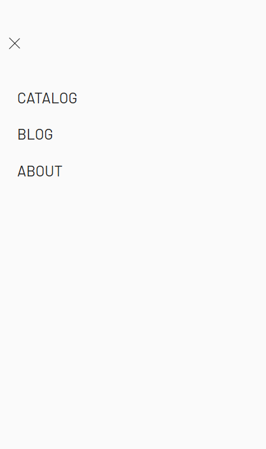
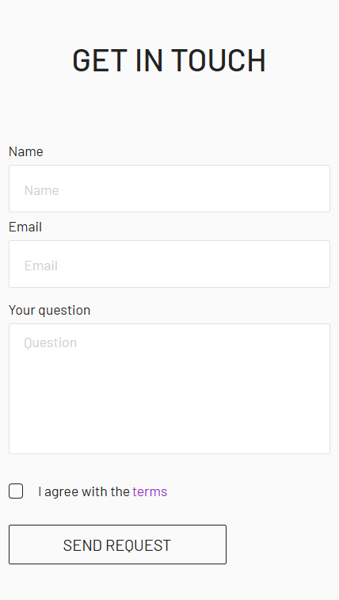

# 🏺 Ceramic Soul


**Ceramic Soul** is a multi-page website for a pottery workshop and store. It features a modern, responsive design, interactive elements, and a cozy atmosphere dedicated to handcrafted ceramics.

🔗 **[Live Demo](https://okaymarta.github.io/ceramic-soul/)**

---

## 📸 Preview

### Home Page & Atmosphere

> _A welcoming landing page with a hero section and workshop details._ > 

### Catalog & Tabs

> _Interactive product catalog with category filtering logic._ > 

### Mobile Responsiveness

> _Fully adaptive navigation and layout for mobile devices._

<div style="display: flex; gap: 10px;">
  
  
</div>

---

## 🛠️ Tech Stack

This project uses a modern frontend setup focused on performance and maintainability.

-   **Core:** HTML5, SCSS, JavaScript (ES6+ Modules)
-   **Build Tool:** [Vite](https://vitejs.dev/) (Fast and lightweight)
-   **Styling:**
    -   SCSS (Nested rules, mixins, variables)
    -   `postcss-pxtorem` (Automatic px-to-rem conversion for accessibility)
    -   [PureCSS](https://purecss.io/) (Lightweight grid system)
    -   [Fontello](https://fontello.com/) (Icon fonts)
-   **Libraries:**
    -   [Swiper.js](https://swiperjs.com/) (Touch-enabled sliders)
    -   [JustValidate](https://just-validate.dev/) (Client-side form validation)
-   **Optimization:** `vite-plugin-imagemin` (Image compression)

---

## ✨ Key Features

-   **Multi-page Architecture:** Separate pages for Home, Catalog, Blog, and About using Vite's multi-page app configuration.
-   **Interactive Components:**
    -   **Custom Burger Menu:** Smooth open/close animation blocking body scroll.
    -   **Tabs System:** JavaScript-based filtering in the Catalog section.
    -   **Carousels:** Responsive image sliders for the "Works" section.
-   **Form Handling:**
    -   Real-time validation for Name, Email, and Checkboxes.
    -   Asynchronous data submission (mocked via `httpbin.org`).
-   **Responsive Design:** Adaptive grid layout (`pure-g`) that looks great on desktops, tablets, and phones.

---

## 🚀 Installation & Setup

If you want to run this project locally:

1.  **Clone the repository**

    ```bash
    git clone https://github.com/okaymarta/ceramic-soul.git
    cd ceramic-soul
    ```

2.  **Install dependencies**

    ```bash
    npm install
    ```

3.  **Run development server**

    ```bash
    npm run dev
    ```

4.  **Build for production**
    ```bash
    npm run build
    ```

---

## 📂 Project Structure

```text
ceramic_soul/
├── public/              # Static assets (favicons, manifest)
├── src/
│   ├── img/             # Project images (optimized)
│   ├── js/              # Main scripts (Swiper, logic)
│   ├── sass/            # Styles (Blocks, UI, Base)
│   └── font/            # Webfonts
├── about.html           # About page
├── blog.html            # Blog page
├── catalog.html         # Catalog page
├── index.html           # Main entry point
├── vite.config.js       # Vite configuration
└── package.json         # Dependencies
```

---

## 👩‍💻 Author

**Marta Okilka**

Designed and Developed with ❤️ for ceramic art.

---

## 🎓 About the Project

This project was developed as a capstone assignment for the **WEB-developer** course on the Udemy platform.. It represents my journey from learning the basics to building a fully functional, multi-page website with modern tooling.
